# 无人机巡防管控系统

<div align="center">


</div>

## 项目简介

这是一个面向高校课程设计和毕业设计的无人机巡防管控系统，采用前后端分离（Frontend-Backend Separation）架构，实现了完整的设备管理（Device Management）、航线规划（Route Planning）、任务执行（Task Execution）和结果管理（Result Management）业务闭环。

### 核心特性

- 🎯 **前后端分离**：Spring Boot + Vue 3 现代化架构
- 🔐 **安全认证**：JWT（JSON Web Token）无状态（Stateless）认证
- 🤖 **AI智能分析**：集成智谱AI（ZhipuAI），智能评估巡防风险
- 📊 **数据导出**：支持Excel报表导出
- 🗺️ **地图集成**：高德地图（Amap）航线可视化
- 📱 **响应式设计**：适配多种屏幕尺寸

---

## 系统架构图（System Architecture）

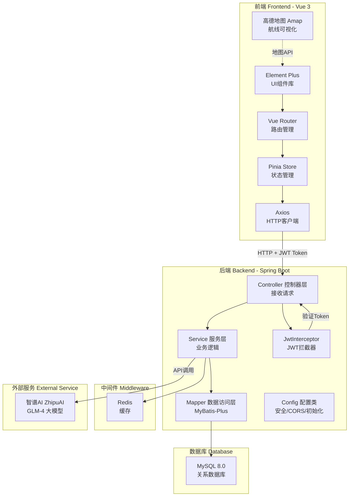

---

## 实体类图（Entity Class Diagram）

系统共包含6个核心实体（Entity），它们之间的关系如下：

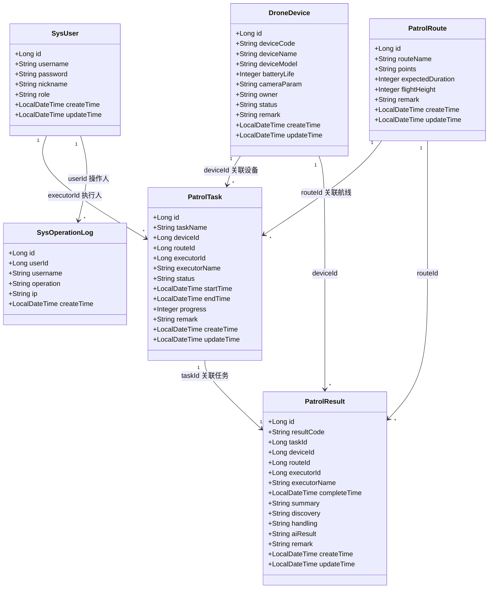

---

## 数据库ER图（Entity-Relationship Diagram）

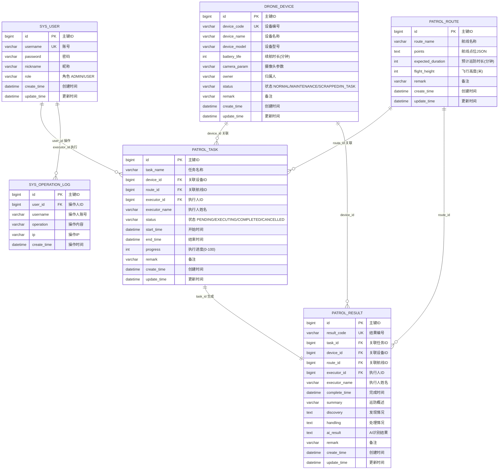

---

## 核心业务流程图（Business Flow）

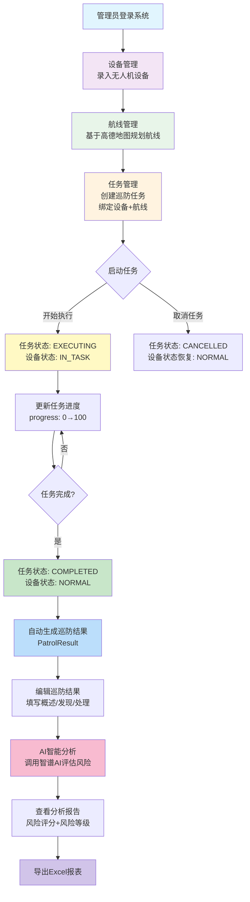

---

## 时序图（Sequence Diagram）

### 用户登录认证流程（Login Authentication）

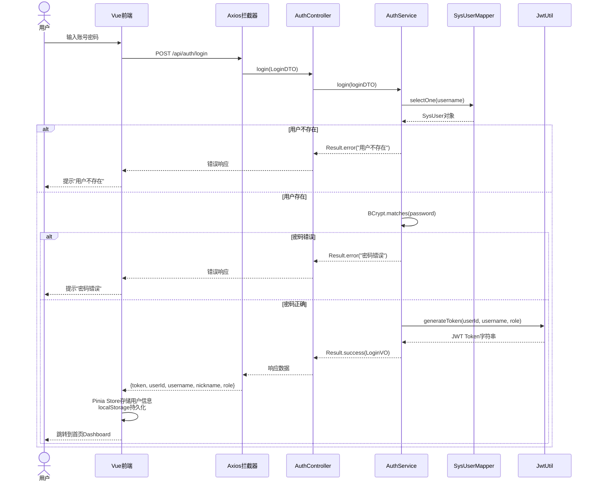

### 任务执行与完成流程（Task Execution & Completion）

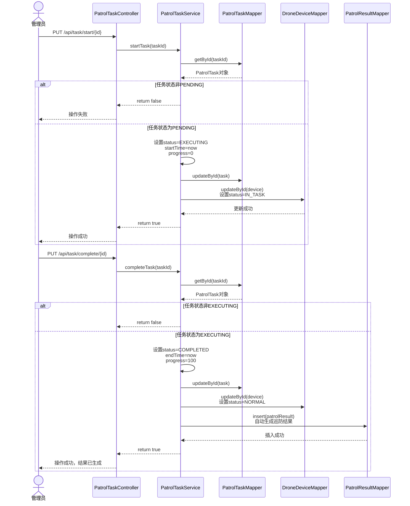

### AI智能分析流程（AI Analysis）

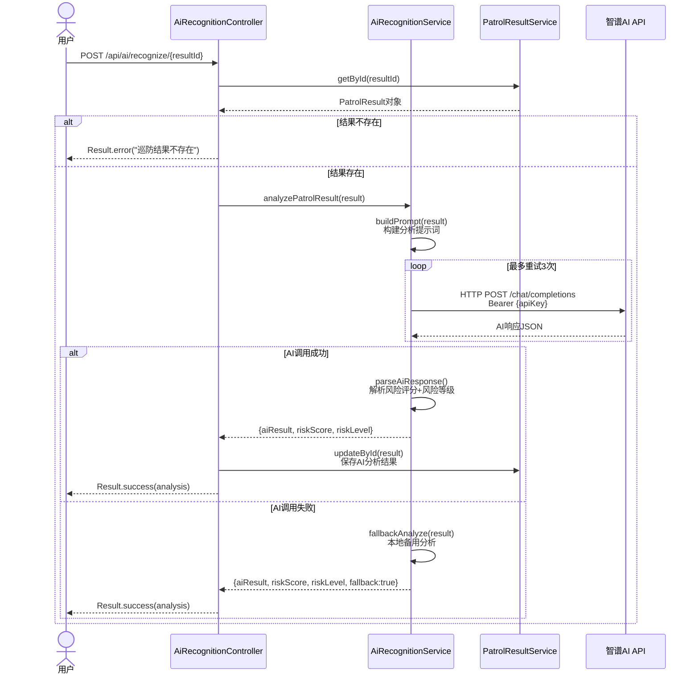

---

## 后端分层架构图（Backend Layered Architecture）

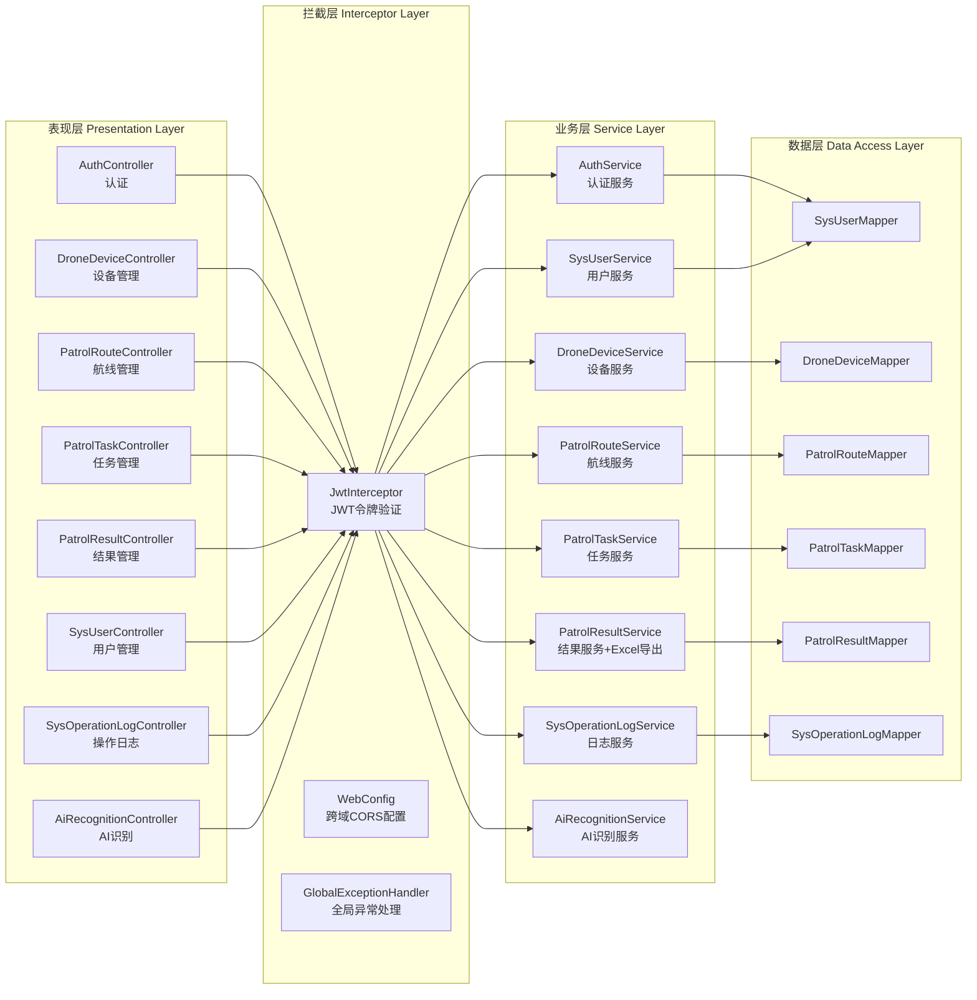

---

## 技术栈

### 后端（Backend）

| 技术 | 版本 | 说明 |
|------|------|------|
| Spring Boot | 2.7.18 | 核心框架（Core Framework） |
| MySQL | 8.0 | 关系数据库（Relational Database） |
| Redis | - | 缓存中间件（Cache Middleware） |
| MyBatis-Plus | 3.5.5 | ORM框架（对象关系映射） |
| JWT (jjwt) | 0.11.5 | 身份认证（Authentication） |
| Apache POI | 5.2.5 | Excel操作（Spreadsheet Export） |
| Hutool | 5.8.26 | 工具类库（Utility Library） |
| Spring Security | - | 安全框架（Security Framework），禁用默认登录 |
| BCrypt | - | 密码加密（Password Encryption） |
| Lombok | - | 代码简化（Code Simplification） |

### 前端（Frontend）

| 技术 | 版本 | 说明 |
|------|------|------|
| Vue | 3 | 核心框架（Core Framework） |
| Vite | 5 | 构建工具（Build Tool） |
| Element Plus | 最新 | UI组件库（UI Component Library） |
| Vue Router | 4 | 路由管理（Router Management） |
| Pinia | - | 状态管理（State Management） |
| Axios | - | HTTP客户端（HTTP Client） |
| 高德地图 Amap | API | 地图服务（Map Service） |
| vue-i18n | 9.14 | 国际化（Internationalization） |

---

## 功能模块

### 功能模块总览图

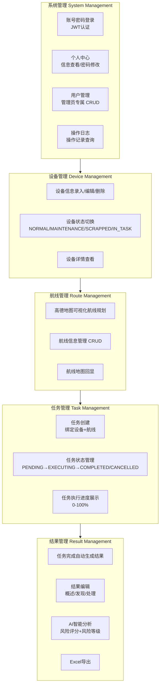

1. **系统管理（System Management）**
   - 账号密码登录（JWT认证 Authentication）
   - 个人中心（信息查看、密码修改）
   - 用户管理（管理员专属，CRUD增删改查）
   - 操作日志记录（Operation Log）

2. **设备管理（Device Management）**
   - 设备信息录入、编辑、删除
   - 设备状态切换（NORMAL正常 / MAINTENANCE维修中 / SCRAPPED已报废 / IN_TASK任务中）
   - 设备详情查看

3. **航线管理（Route Management）**
   - 基于高德地图的可视化航线规划
   - 航线信息管理（CRUD增删改查）
   - 航线地图回显

4. **任务管理（Task Management）**
   - 任务创建（绑定设备和航线）
   - 任务状态管理（PENDING待执行 → EXECUTING执行中 → COMPLETED已完成 / CANCELLED已取消）
   - 任务执行进度展示（Progress 0-100%）

5. **结果管理（Result Management）**
   - 任务完成自动生成结果
   - 结果编辑（概述Summary / 发现Discovery / 处理Handling）
   - AI智能分析（风险评分Risk Score + 风险等级Risk Level）
   - Excel导出

---

## 快速开始

### 环境要求

- JDK 8+
- Node.js 16+
- MySQL 8.0
- Redis

### 注意事项

⚠️ **重要：所有命令行操作必须在 Windows CMD 中执行，禁止使用 PowerShell！**

### 1. 数据库初始化（Database Initialization）

在 CMD 中执行以下操作：

```cmd
# 登录 MySQL（请替换为您的账号密码）
mysql -u root -p

# 执行以下 SQL 创建数据库
CREATE DATABASE drone_patrol DEFAULT CHARACTER SET utf8mb4 COLLATE utf8mb4_unicode_ci;

# 退出 MySQL
exit;

# 导入初始化脚本（请替换为实际路径）
mysql -u root -p drone_patrol < D:\_class\drone-patrol\sql\init.sql
```

### 2. Redis 启动

```cmd
# 方式1：如果已安装为系统服务
sc start Redis

# 方式2：解压版，请替换为您的Redis目录
D:
cd D:\Redis-x64-6.2.14
redis-server.exe redis.windows.conf
```

### 3. 后端启动（Backend Startup）

```cmd
# 进入后端目录
D:
cd D:\_class\drone-patrol\server

# 修改 application.yml 中的数据库和Redis配置
# 编辑 src\main\resources\application.yml

# 使用 Maven 启动
mvn spring-boot:run
```

后端默认端口：8080

### 4. 前端启动（Frontend Startup）

打开新的 CMD 窗口：

```cmd
# 进入前端目录
D:
cd D:\_class\drone-patrol\web

# 安装依赖
npm install

# 配置高德地图 Key（可选，需要时修改 index.html）
# 编辑 index.html，替换 YOUR_AMAP_KEY

# 启动开发服务
npm run dev
```

前端默认访问地址：http://localhost:3000

### 5. 系统登录（System Login）

默认账号：
- 管理员（Administrator）：admin / admin123
- 普通用户（User）：user / admin123

---

## 项目结构

```
drone-patrol/
├── server/                 # 后端项目 Backend
│   ├── src/
│   │   ├── main/
│   │   │   ├── java/com/drone/patrol/
│   │   │   │   ├── common/         # 通用类 Common
│   │   │   │   │   └── Result.java           # 统一响应封装（Unified Response）
│   │   │   │   ├── config/          # 配置类 Configuration
│   │   │   │   │   ├── GlobalExceptionHandler.java  # 全局异常处理
│   │   │   │   │   ├── InitDataConfig.java          # 初始数据配置
│   │   │   │   │   ├── MybatisPlusConfig.java       # MyBatis-Plus分页配置
│   │   │   │   │   ├── PasswordEncoderConfig.java   # 密码编码器配置
│   │   │   │   │   ├── SecurityConfig.java          # Spring Security配置
│   │   │   │   │   ├── WebConfig.java               # CORS跨域+JWT拦截器配置
│   │   │   │   │   └── ZhipuConfig.java             # 智谱AI配置
│   │   │   │   ├── controller/       # 控制器层 Controller
│   │   │   │   │   ├── AuthController.java          # 认证控制器
│   │   │   │   │   ├── DroneDeviceController.java   # 设备管理控制器
│   │   │   │   │   ├── PatrolRouteController.java   # 航线管理控制器
│   │   │   │   │   ├── PatrolTaskController.java    # 任务管理控制器
│   │   │   │   │   ├── PatrolResultController.java  # 结果管理控制器
│   │   │   │   │   ├── SysUserController.java       # 用户管理控制器
│   │   │   │   │   ├── SysOperationLogController.java # 操作日志控制器
│   │   │   │   │   └── AiRecognitionController.java   # AI识别控制器
│   │   │   │   ├── dto/              # 数据传输对象 DTO（Data Transfer Object）
│   │   │   │   │   ├── LoginDTO.java               # 登录请求参数
│   │   │   │   │   └── RegisterDTO.java            # 注册请求参数
│   │   │   │   ├── entity/            # 实体类 Entity
│   │   │   │   │   ├── SysUser.java                # 系统用户
│   │   │   │   │   ├── DroneDevice.java            # 无人机设备
│   │   │   │   │   ├── PatrolRoute.java            # 巡防航线
│   │   │   │   │   ├── PatrolTask.java             # 巡防任务
│   │   │   │   │   ├── PatrolResult.java           # 巡防结果
│   │   │   │   │   └── SysOperationLog.java        # 操作日志
│   │   │   │   ├── interceptor/       # 拦截器 Interceptor
│   │   │   │   │   └── JwtInterceptor.java         # JWT令牌验证拦截器
│   │   │   │   ├── mapper/            # 数据访问层 Mapper（DAO）
│   │   │   │   ├── service/           # 业务逻辑层 Service
│   │   │   │   │   ├── AuthService.java            # 认证服务
│   │   │   │   │   ├── DroneDeviceService.java     # 设备服务
│   │   │   │   │   ├── PatrolRouteService.java     # 航线服务
│   │   │   │   │   ├── PatrolTaskService.java      # 任务服务
│   │   │   │   │   ├── PatrolResultService.java    # 结果服务（含Excel导出）
│   │   │   │   │   ├── SysUserService.java         # 用户服务
│   │   │   │   │   ├── SysOperationLogService.java # 日志服务
│   │   │   │   │   └── AiRecognitionService.java   # AI识别服务
│   │   │   │   ├── util/             # 工具类 Utility
│   │   │   │   │   └── JwtUtil.java               # JWT令牌工具类
│   │   │   │   ├── vo/               # 视图对象 VO（View Object）
│   │   │   │   │   └── LoginVO.java               # 登录响应数据
│   │   │   │   └── DronePatrolApplication.java     # 启动入口
│   │   │   └── resources/
│   │   │       └── application.yml                 # 应用配置文件
│   │   └── pom.xml                                 # Maven依赖配置
├── web/                   # 前端项目 Frontend
│   ├── src/
│   │   ├── components/              # 公共组件 Component
│   │   │   └── ParticleBackground.vue  # 粒子背景效果
│   │   ├── router/                  # 路由配置 Router
│   │   │   └── index.js             # 路由定义+导航守卫
│   │   ├── store/                   # 状态管理 Store（Pinia）
│   │   │   └── user.js              # 用户状态+localStorage持久化
│   │   ├── utils/                   # 工具函数 Utility
│   │   │   └── request.js           # Axios封装+请求/响应拦截器
│   │   ├── views/                   # 页面组件 View
│   │   │   ├── Login.vue            # 登录页
│   │   │   ├── Layout.vue           # 布局组件（侧边栏+顶栏）
│   │   │   ├── Dashboard.vue        # 首页仪表盘
│   │   │   ├── Device.vue           # 设备管理
│   │   │   ├── Route.vue            # 航线管理
│   │   │   ├── Task.vue             # 任务管理
│   │   │   ├── Result.vue           # 结果管理
│   │   │   ├── User.vue             # 用户管理
│   │   │   ├── Log.vue              # 操作日志
│   │   │   └── Profile.vue          # 个人中心
│   │   ├── App.vue                  # 根组件
│   │   └── main.js                  # 入口文件
│   ├── index.html                   # HTML模板（含高德地图Key）
│   ├── vite.config.js               # Vite配置（代理+别名）
│   └── package.json                 # 依赖配置
├── sql/                   # 数据库脚本 SQL
│   └── init.sql                     # 初始化脚本（建表）
└── README.md
```

---

## 前端路由与页面映射（Router & View Mapping）

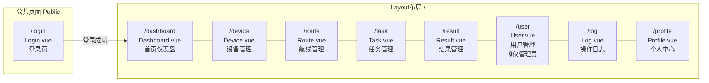

---

## 请求认证流程（Request Authentication Flow）

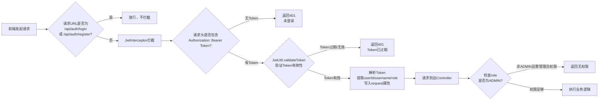

---

## CMD 专属操作脚本

为方便操作，项目提供以下 CMD 批处理脚本（需自行创建）：

### start-all.bat - 一键启动

```cmd
@echo off
echo 正在启动无人机巡防管控系统...

echo.
echo [1/4] 检查 MySQL 服务...
sc query MySQL80

echo.
echo [2/4] 启动 Redis...
start "Redis" cmd /k "cd /d D:\Redis-x64-6.2.14 && redis-server.exe redis.windows.conf"

echo.
echo [3/4] 等待 Redis 启动...
timeout /t 3 /nobreak

echo.
echo [4/4] 启动后端服务...
cd /d D:\_class\drone-patrol\server
start "后端" cmd /k "mvn spring-boot:run"

echo.
echo 后端服务启动中，等待 10 秒后启动前端...
timeout /t 10 /nobreak

echo.
echo 启动前端服务...
cd /d D:\_class\drone-patrol\web
start "前端" cmd /k "npm run dev"

echo.
echo ========================================
echo 系统正在启动...
echo 前端地址: http://localhost:3000
echo 后端地址: http://localhost:8080
echo 默认账号: admin / admin123
echo ========================================
pause
```

### 配置说明

- 数据库配置：server/src/main/resources/application.yml
- 高德地图 Key：web/index.html

---

## API 文档

### 认证接口（Authentication API）

#### 登录（Login）

```
POST /api/auth/login
Content-Type: application/json

Request:
{
  "username": "admin",
  "password": "admin123"
}

Response:
{
  "code": 200,
  "message": "登录成功",
  "data": {
    "token": "eyJhbGciOiJIUzI1NiIs...",
    "userId": 1,
    "username": "admin",
    "nickname": "管理员",
    "role": "ADMIN"
  }
}
```

#### 注册（Register）

```
POST /api/auth/register
Content-Type: application/json

Request:
{
  "username": "newuser",
  "password": "password123",
  "nickname": "新用户"
}

Response:
{
  "code": 200,
  "message": "操作成功",
  "data": null
}
```

### 设备管理接口（Device API）

#### 获取设备列表（分页）

```
GET /api/device/page
Authorization: Bearer {token}

Query Parameters:
- pageNum: 页码（默认1）
- pageSize: 每页数量（默认10）
- deviceCode: 设备编号（可选，模糊查询）
- deviceName: 设备名称（可选，模糊查询）
- status: 设备状态（可选）
- owner: 归属人（可选，模糊查询）
```

#### 新增设备

```
POST /api/device
Authorization: Bearer {token}
Content-Type: application/json

Request:
{
  "deviceCode": "DRONE001",
  "deviceName": "巡检无人机1号",
  "deviceModel": "DJI Mavic 3",
  "batteryLife": 45,
  "cameraParam": "4K高清",
  "owner": "张三",
  "status": "NORMAL"
}
```

### 航线管理接口（Route API）

```
GET /api/route/page
Authorization: Bearer {token}

Query Parameters:
- pageNum: 页码
- pageSize: 每页数量
- routeName: 航线名称（可选，模糊查询）
```

### 任务管理接口（Task API）

```
GET /api/task/page
Authorization: Bearer {token}

Query Parameters:
- pageNum / pageSize
- taskName: 任务名称（可选）
- executorName: 执行人（可选）
- status: 任务状态（可选 PENDING/EXECUTING/COMPLETED/CANCELLED）
- startTime / endTime: 时间范围（可选）

PUT /api/task/start/{id}     - 开始执行任务
PUT /api/task/complete/{id}  - 完成任务
PUT /api/task/cancel/{id}    - 取消任务
PUT /api/task/progress?id=&progress=  - 更新进度
```

### 结果管理接口（Result API）

```
GET /api/result/page
Authorization: Bearer {token}

Query Parameters:
- pageNum / pageSize
- resultCode: 结果编号（可选）
- executorName: 执行人（可选）
- startTime / endTime: 时间范围（可选）

GET /api/result/export       - 导出Excel
PUT /api/result              - 编辑结果
```

### AI识别接口（AI Recognition API）

```
POST /api/ai/recognize/{resultId}   - AI分析并保存结果
GET /api/ai/analyze/{resultId}      - AI分析（不保存）
```

### 响应码说明（Response Code）

| 响应码 | 说明 |
|--------|------|
| 200 | 请求成功（Success） |
| 400 | 请求参数错误（Bad Request） |
| 401 | 未授权（Unauthorized，Token无效或过期） |
| 403 | 权限不足（Forbidden） |
| 500 | 服务器内部错误（Internal Server Error） |

---

## 配置说明

### 数据库配置（Database Configuration）

文件：`server/src/main/resources/application.yml`

```yaml
spring:
  datasource:
    url: jdbc:mysql://localhost:3306/drone_patrol?useUnicode=true&characterEncoding=utf-8&useSSL=false&serverTimezone=Asia/Shanghai
    username: root
    password: your_password
```

### Redis配置

```yaml
spring:
  redis:
    host: localhost
    port: 6379
    database: 0
    timeout: 5000ms
```

### JWT配置

```yaml
jwt:
  secret: your-32-character-secret-key-here
  expiration: 86400000  # 24小时（毫秒 milliseconds）
```

### 高德地图配置（Amap Configuration）

文件：`web/index.html`

```html
<script type="text/javascript">
  window._AMAP_API_KEY = 'YOUR_AMAP_KEY';
</script>
```

### 智谱AI配置（ZhipuAI Configuration）

```yaml
zhipu:
  api-key: your-zhipu-api-key
  base-url: https://open.bigmodel.cn/api/paas/v4/chat/completions
  model: glm-4-flash
```

---

## 常见问题

### 1. Maven 依赖下载慢

<details>
<summary>点击展开解决方案</summary>

配置 Maven 使用国内镜像源加速下载。在 Maven 的 `settings.xml` 文件中添加：

```xml
<mirrors>
  <mirror>
    <id>aliyun</id>
    <name>Aliyun Maven</name>
    <url>https://maven.aliyun.com/repository/public</url>
    <mirrorOf>central</mirrorOf>
  </mirror>
</mirrors>
```

</details>

### 2. npm 依赖下载慢

<details>
<summary>点击展开解决方案</summary>

配置使用淘宝镜像：

```cmd
npm config set registry https://registry.npmmirror.com
```

</details>

### 3. 高德地图不显示

<details>
<summary>点击展开解决方案</summary>

确保已在 `web/index.html` 中配置有效的高德地图 Key：

1. 注册高德开放平台账号
2. 创建应用获取 Key
3. 在 `index.html` 中替换 `YOUR_AMAP_KEY`

</details>

### 4. 数据库连接失败

<details>
<summary>点击展开解决方案</summary>

1. 检查 MySQL 服务是否启动
2. 验证 `application.yml` 中的数据库配置
3. 确认用户名密码正确
4. 检查数据库是否已创建

</details>

### 5. Redis 连接失败

<details>
<summary>点击展开解决方案</summary>

1. 检查 Redis 服务是否启动
2. 验证 `application.yml` 中的 Redis 配置
3. 确认端口号正确（默认6379）

</details>

### 6. 端口被占用

<details>
<summary>点击展开解决方案</summary>

如果 8080 或 3000 端口被占用，可以修改配置：

**后端端口**：修改 `server/src/main/resources/application.yml`

```yaml
server:
  port: 8081
```

**前端端口**：修改 `web/vite.config.js`

```javascript
server: {
  port: 3001
}
```

</details>

---

## 贡献指南

### 如何贡献

1. **Fork 本仓库**
2. **创建特性分支（Feature Branch）**：`git checkout -b feature/AmazingFeature`
3. **提交更改（Commit）**：`git commit -m 'Add some AmazingFeature'`
4. **推送到分支（Push）**：`git push origin feature/AmazingFeature`
5. **创建 Pull Request（合并请求）**

### 开发规范

#### 后端规范（Backend Convention）

- 控制器方法添加 Javadoc 注释
- 服务类添加类注释和方法注释
- 使用 LambdaQueryWrapper 进行查询构造
- 统一使用 Result 类返回响应（Unified Response）
- 写操作需记录操作日志（Operation Log）

#### 前端规范（Frontend Convention）

- 组件使用 `<script setup>` 语法
- 样式使用 Scoped CSS
- 统一使用 ElMessage 提示信息
- 页面文件放在 views 目录

### Commit 规范

```
feat: 新功能（Feature）
fix: 修复bug（Bug Fix）
docs: 文档更新（Documentation）
style: 代码格式（不影响功能）
refactor: 重构（Refactor）
test: 测试相关（Test）
chore: 构建/工具相关（Chore）
```

---

## 更新日志

### v1.0.0 (2024-01-01)

- ✨ 完成基础功能开发
- 🔐 实现JWT认证（Authentication）
- 🤖 集成AI智能分析（AI Analysis）
- 📊 Excel导出功能（Export）
- 🎨 现代化UI设计

---


## 技术支持

- Spring Boot 文档：https://spring.io/projects/spring-boot
- Element Plus 文档：https://element-plus.org/
- 高德地图 API 文档：https://lbs.amap.com/
- MyBatis-Plus 文档：https://baomidou.com/
- 智谱AI 文档：https://open.bigmodel.cn/
